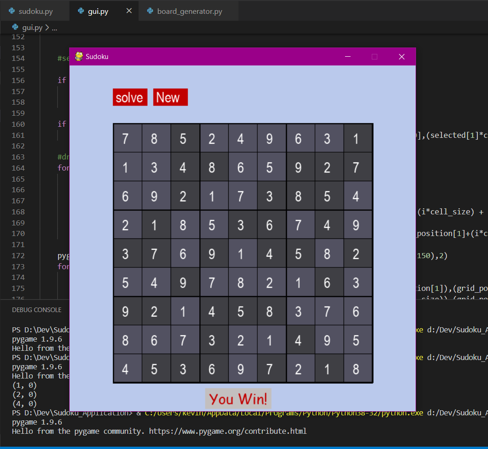

# Sudoku_APP
A Sudoku Application - Using Python(Pygame) 
Press s to solve itself 

<b>Algorithms Used</b> 
1.Naive Algorithm for generation of sudoku 
2.Backtracking Algorithm for solving 
 
It Polls everytime to check for a win 
 
<b>What does it look like?</b> 
 
  

